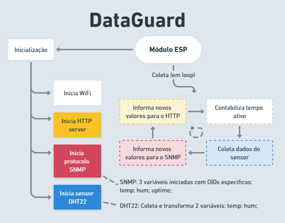

# **DataGuard**
#### Projeto integrador - UNISAL - Engenharia de Computação - 3º Semestre
---
##### Equipe:
Henrique Pignato
Gabriel Vitor Rosa
Kauã Enrico Pasti Altran
Leonardo Fernandes Fanhani
Lucas Gabriel Bento Correa
Luke Gabriel dos Santos Belatine
---

## Acesso ao material
[Apresentação DataGuard](https://github.com/kauaenrico/DataGuard-Project/blob/70844c4920b67016136615777740e0d766250db7/Apresenta%C3%A7%C3%A3o/DataGuard%20Apresentacao%20Final%20v1.pptx)  |   [Artigo DataGuard](https://github.com/kauaenrico/DataGuard-Project/blob/70844c4920b67016136615777740e0d766250db7/Artigo/Artigo-DataGuard_Finalv1.pdf) 
[Projeto Completo](github.com/kauaenrico/DataGuard-Project)

##### NOSSO OBJETIVO
A tecnologia cresce cada vez mais, sendo assim a segurança dos dados se torna primordial.
Quando se fala em oscilações e indisponibilidade, são grandes as chances de ser por conta do Data Center:
➜ Falhas de energia ou hardware
➜ Superaquecimento 
➜ Mal funcionamento por corrosão

##### O DATAGUARD
Uma solução inovadora para o monitoramento e controle de Temperatura e Umidade, sendo fundamental para o funcionamento dos equipamentos de TI, possibilitando a detecção precoce de problemas, tendo medidas preventivas mais rápidas.
Possibilita geração de alertas, contato automático, controle remoto de ações, baseado na temperatura e Umidade em tempo real, a partir do Módulo IoT.

##### SEU PÚBLICO ALVO
Direcionado a empresas que prestam ou possuem serviços de TI (Data Centers, CPDs, Infraestrutura de TI) para Pequeno ou grande porte. Garantem a eficiência e a segurança dos equipamentos de TI, assim como sua operação total.

##### OBJETIVO
DataGuard, projetado para eficiência, confiabilidade e adaptabilidade a infraestrutura de TI.
Proporciona solução inteligente para monitoramento e mantenimento em Data Centers, ambientes críticos que necessitam de funcionamento contínuo, 24h/7d.
➜ Monitoramento em tempo real
➜ Geração de alertas e avisos
➜ Controle e operação do ambiente
➜ Integração com sistemas já existentes
➜ Análise aprofundada dos dados

Segue a **Norma ABNT 14565:2013**, que recomenda a temperatura e umidade relativas em uma variação especifica:
➜ Temperatura 18°C a 27°C
➜ Umidade 30% a 60%

##### DESENVOLVIMENTO
Estabelecemos a base de funcionamento para nossa solução de monitoramento:

IMAGEM DO FLUXOGRAMA WHIMSCAL

Utilizamos o módulo ESP8266 e DHT22
IMAGEM FRITZING ESQUEMA ELETRONICO
Positivo (3,3v)
Negativo (GND)
UART (TX/RX)

##### DESENVOLVIMENTO>FIRMWARE
Utilizado linguagem C para sistema base para o microcontrolador, programado a partir do Arduino IDE
Utilização de bibliotecas para o uso das funções e condições
Adafruit Sensor
ESP8266WiFi
WiFiUdp
Arduino_SNMP
E varias outras…

##### DESENVOLVIMENTO>COMUNICAÇÕES
Protocolos utilizados
HTTP - Protocolo de Transferência de Hipertexto
Utiliza porta TCP 80 para comunicação
SNMP - Simple Network Management Protocol
Utiliza porta UDP 161 e 162 para comunicação

##### DESENVOLVIMENTO>APLICAÇÃO
Com o módulo DataGuard operacional, as aplicações selecionadas são Zabbix e Power BI. O Zabbix, uma plataforma open-source, é amplamente adotado por empresas com departamentos de TI, permitindo o monitoramento abrangente da infraestrutura de TI, incluindo alertas de incidentes, ações, dashboards e relatórios configuráveis.
Por meio do Zabbix, é possível configurar alertas de incidentes, ações, dashboards e relatórios. Em seguida, o Power BI entra em cena como uma plataforma de análise e tratamento de dados. Ele realiza transformações nos dados gerenciados, aplicando modelos analíticos para gerar insights, tendências e previsões relevantes.
O Power BI é especialmente empregado para análises e inteligência, alimentando relatórios de segurança que identificam pontos de falha e antecipam tendências no desempenho da refrigeração. Além disso, por meio de técnicas de machine learning, o Power BI propicia análises que visam otimizar o consumo de energia. Essas análises sugerem automaticamente ajustes no controle da refrigeração, identificando períodos em que a redução ou desligamento do sistema são viáveis, com o objetivo de economizar energia.

##### Funcionamento
Como mencionado anteriormente, o módulo foi desenvolvido, compreendendo o ESP8266 e o sensor DHT22. Na fase de inicialização, a conexão WiFi é estabelecida pelo módulo, o servidor HTTP é aberto e o protocolo é implementado através da biblioteca desenvolvida para esse propósito.
A leitura do sensor é realizada em intervalos de um segundo, e os protocolos são utilizados para transmitir os novos valores. A resposta gerada pelo módulo é exibida no monitor serial, o qual é empregado como uma ferramenta de depuração do código.
Para fins de demonstração, a funcionalidade HTTP permanece acessível, permitindo a visualização dos dados brutos transmitidos. O módulo, ao se comunicar com o Zabbix, atualiza o banco de dados com os novos valores obtidos. Consequentemente, o Zabbix gera alertas e executa ações com base nos valores adquiridos.
Em relação ao PowerBI, este obtém as informações registradas no banco de dados e as utiliza para gerar relatórios e análises que se mostram necessários.

##### CONCLUSÕES
Desenvolvemos uma ideia a partir de um problema do dia-a-dia no trabalho
Projeto eficaz que pode beneficiar a todos mantenedores de data centers, trazendo mais segurança para a vivência de TI.
De forma indireta, beneficia toda a sociedade usuária de tecnologias de informação e comunicação.

##### PROJETO DE VIDA
Toda a equipe obteve novos conhecimentos a partir da realização do projeto
Agregou técnica, preparando para o futuro em TI.
Projeto com possível aprimoramento e aprofundamento, melhorando o essencial e aprimorando com machine learning, segurança e recursos adicionais.

#### _DataGuard melhorando a informação e comunicação!_
